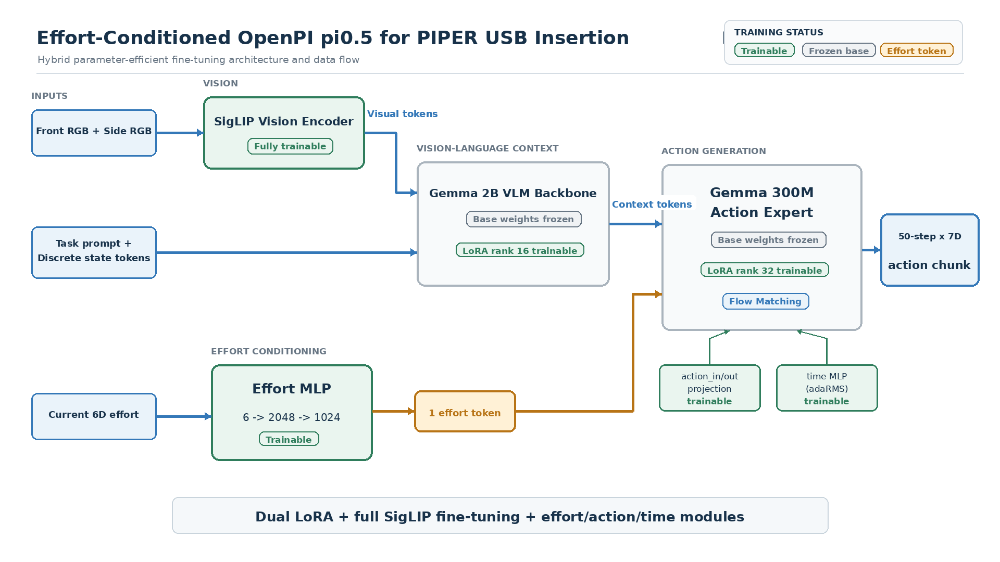

# 基于 OpenPI π0.5 与关节 Effort 条件的 PIPER 插 USB 项目介绍

## 1. 项目概述

本项目面向 PIPER 机械臂执行“将 USB 插入排插上的 USB 接口”任务。插接任务同时要求视觉定位、末端精细对准和接触阶段的状态调整，仅使用图像与关节位置时，策略难以及时感知已经发生的碰撞、卡阻或插入力变化。因此，本项目在官方 JAX 版 OpenPI π0.5 上增加六维关节 effort 条件，让动作专家在生成动作块时同时参考当前机械臂的负载反馈。

任务文本为：

```text
Insert the USB into the USB port on the power strip.
```

最终方案采用：

```text
官方 JAX π0.5
+ PaliGemma rank-16 LoRA
+ Action Expert rank-32 LoRA
+ 当前单帧 6 维 effort MLP token
+ 两路 RGB 图像
+ 7 维关节/夹爪状态
```

最终训练配置与 checkpoint：

```text
配置名：pi05_piper_usb_effort_lora
实验名：usb_effort_lora_bs24_30k
全局 batch size：24
训练步数：30,000
最终 checkpoint：
/data5/zjh/openpi/checkpoints/pi05_piper_usb_effort_lora/usb_effort_lora_bs24_30k/29999
```

部署源码与模型发布地址：

```text
GitHub：
https://github.com/fff1233f/pi05-piper-usb-effort

Hugging Face：
https://huggingface.co/fff1233f/pi05-piper-usb-effort-lora

国内 HF 镜像：
https://hf-mirror.com/fff1233f/pi05-piper-usb-effort-lora
```

## 2. 项目目标与技术路线

项目的核心目标不是从零训练一个视觉语言动作模型，而是尽量保留 π0.5 的预训练知识，只为 PIPER 插 USB 任务增加必要的机器人数据适配和 effort 感知能力。

整体路线为：

```text
PIPER 示范数据采集
    ↓
LeRobot v2.1 原始数据
    ↓
转换为 LeRobot v3.0 数据布局
    ↓
计算 state / delta action / effort 归一化统计量
    ↓
加载官方 pi05_base 权重
    ↓
新增 effort MLP 连续 token
    ↓
双 LoRA + 非 LLM 模块联合微调
    ↓
Orbax/JAX checkpoint
    ↓
OpenPI WebSocket 策略服务
    ↓
本地 PIPER 控制端执行动作
```

首版设计遵循两个原则：

1. 不改变 π0.5 已预训练的离散 state 文本格式。
2. effort 作为独立连续 token 进入 action expert，不把连续力矩数值硬编码成文本。

## 3. 系统组成

完整实机系统由策略服务和机器人控制端两部分组成。

```text
前视相机 ─┐
侧视相机 ─┼─> PIPER 控制端 ──WebSocket──> π0.5 策略服务
关节状态 ─┤                                     │
关节effort ┘                                     │
                                                   ↓
PIPER 控制端 <──────────── 50 × 7 动作块 ─────────┘
      │
      ↓
安全检查、限位、速度限制、动作下发
      │
      ↓
PIPER 底层位置伺服
```

`scripts/serve_policy.py` 只负责加载模型并提供推理服务，不会直接连接或控制机械臂。当前仓库中也没有完整的 PIPER 硬件控制脚本，实机端需要把现有 PIPER SDK 控制程序与 `openpi-client` 推理调用连接起来。

## 4. 机器人、场景与已知边界

数据元信息记录：

```text
robot_type：piper
```

因此可以确认数据来自 PIPER 机械臂，但仅凭数据集不能确认 PIPER 的具体硬件子型号。需要通过机械臂铭牌、采购信息、控制器型号或原始采集程序进一步确认。

同样，数据字段名称为 `observation.effort`，但数据元信息没有记录单位和来源。它可能是驱动器估计关节力矩、电机电流换算值或 SDK 提供的负载反馈。除非采集端明确给出定义，否则不能把它直接解释为牛顿米，也不能把六维关节 effort 直接当成末端六维力/力矩传感器读数。

目前已确定：

| 项目 | 当前信息 |
| --- | --- |
| 机器人类型 | PIPER |
| 具体子型号 | 数据集无法确认 |
| 控制输出 | 6 个关节位置目标 + 1 个夹爪目标 |
| effort 输入 | 6 个机械臂关节反馈 |
| effort 单位 | 数据集未声明，需从 SDK/采集代码确认 |
| 相机 | 前视相机 + 侧视相机 |
| 任务对象 | USB 与排插 USB 接口 |

## 5. 数据采集

### 5.1 原始数据位置与规模

原始数据集：

```text
/data5/usb_0808
```

数据集元信息：

| 项目 | 数值 |
| --- | ---: |
| LeRobot 数据格式 | v2.1 |
| episode 数 | 100 |
| 总帧数 | 42,406 |
| 采样频率 | 30 FPS |
| 总时长 | 约 1,413.5 秒，即 23.56 分钟 |
| 平均 episode | 424.06 帧，即 14.14 秒 |
| 最短 episode | 127 帧，即 4.23 秒 |
| 最长 episode | 1,396 帧，即 46.53 秒 |
| episode 中位数 | 364 帧，即 12.13 秒 |
| 数据体积 | 约 768 MiB |
| 任务数 | 1 |
| 数据划分 | `train: 0:100`，全部 episode 用于训练 |

当前没有独立验证集或测试集。因此，训练 loss 只能反映训练数据拟合程度，不能代替实机成功率评估。

### 5.2 每帧记录内容

原始数据每帧包含：

| 字段 | 形状 | 作用 | 本项目是否用于训练 |
| --- | --- | --- | --- |
| `observation.images.front` | `[480, 640, 3]` | 前视 RGB 图像 | 是 |
| `observation.images.side` | `[480, 640, 3]` | 侧视 RGB 图像 | 是 |
| `observation.state` | `[7]` | 6 关节位置 + 夹爪 | 是 |
| `observation.effort` | `[6]` | 6 关节 effort | 是 |
| `action` | `[7]` | 6 关节目标 + 夹爪目标 | 是 |
| `observation.ee_pose` | `[7]` | 末端位姿 + 夹爪 | 否 |
| `action.ee_pose` | `[7]` | 末端目标位姿 + 夹爪 | 否 |
| `timestamp` | `[1]` | episode 内时间戳 | 用于数据组织 |
| `frame_index` | `[1]` | episode 内帧号 | 用于数据组织 |
| `episode_index` | `[1]` | episode 编号 | 用于数据组织 |
| `task_index` | `[1]` | 任务编号 | 用于关联 prompt |

两路视频均为：

```text
分辨率：640 × 480
帧率：30 FPS
编码：AV1
像素格式：yuv420p
音频：无
```

每个 episode 有两段视频，因此 100 个 episode 共 200 个视频。

### 5.3 关节字段顺序

`observation.state` 和 `action` 的顺序：

```text
joint_1
joint_2
joint_3
joint_4
joint_5
joint_6
gripper
```

`observation.effort` 的顺序：

```text
effort_joint_1
effort_joint_2
effort_joint_3
effort_joint_4
effort_joint_5
effort_joint_6
```

部署时必须保持与采集时完全相同的关节顺序、单位、零点定义和夹爪范围。

### 5.4 effort 数据范围

原始 42,406 帧上的 effort 统计如下：

| 关节 | 最小值 | 最大值 | 均值 | 标准差 |
| --- | ---: | ---: | ---: | ---: |
| J1 | -2.2444 | 2.4806 | 0.1842 | 0.4743 |
| J2 | -16.2776 | 6.5347 | -5.8587 | 2.7847 |
| J3 | -9.0436 | 5.2542 | -5.3509 | 1.9483 |
| J4 | -1.6897 | 1.1319 | -0.3828 | 0.1798 |
| J5 | -1.5258 | 0.9220 | 0.0847 | 0.1586 |
| J6 | -0.6642 | 0.3412 | -0.0234 | 0.1236 |

J2、J3 的均值存在明显静态偏置，这可能来自机械臂重力负载、驱动器估计方式或零偏。当前模型通过数据集统计量归一化后学习这些值，没有额外进行重力补偿或零偏标定。

### 5.5 从零复现采集时的要求

原始采集程序不在当前 OpenPI 仓库中，因此不能从本仓库证明示范是通过示教器、主从遥操作、键盘还是其他方式产生。重新采集时至少应保证：

1. 两路相机、state、effort、action 使用统一时钟或足够准确的时间对齐。
2. 每帧保存实际机器人状态和当时下发的动作目标，不能把二者混为一列。
3. effort 使用原始稳定单位，训练和部署保持一致，不在控制端重复归一化。
4. 相机安装位置、曝光、视野和 USB/排插外观尽量覆盖部署分布。
5. 记录接近、对准、接触、调整和插入完成全过程，不只保留接触前轨迹。
6. 删除机械臂异常、相机丢帧、明显失步和危险碰撞 episode。
7. 最好记录成功/失败标签、最大 effort、插入深度和完成时间，便于后续客观评估。
8. 采集端配置关节限位、速度限制、急停和人工接管。

## 6. LeRobot 数据版本转换

### 6.1 为什么要转换

原始数据格式是 LeRobot v2.1，而当前 OpenPI 环境固定使用 PyPI `lerobot==0.4.4`。LeRobot Python 包 0.4.4 内部使用的数据布局版本是 v3.0。

这两个版本号含义不同：

| 名称 | 当前值 | 含义 |
| --- | --- | --- |
| LeRobot Python 包版本 | 0.4.4 | Dataset API 和读取代码版本 |
| LeRobot 数据格式版本 | v3.0 | `meta/data/videos` 的磁盘布局版本 |

正确训练组合是：

```text
lerobot==0.4.4 + codebase_version=v3.0
```

### 6.2 转换目录

转换后的训练副本：

```text
/data5/usb_0808_pi05_v3
```

转换后保持：

```text
episodes：100
frames：42,406
fps：30
robot_type：piper
state/action/effort/双相机字段：保留
```

转换主要改变 Parquet、视频和元数据的组织方式，不改变任务语义。原始 `/data5/usb_0808` 保留不动，避免破坏唯一原始数据。

### 6.3 参考转换命令

转换脚本会原地修改目标目录，因此先复制：

```bash
cp -a /data5/usb_0808 /data5/usb_0808_pi05_v3

python /path/to/lerobot/src/lerobot/scripts/convert_dataset_v21_to_v30.py \
  --repo-id=usb_0808_pi05_v3 \
  --root=/data5/usb_0808_pi05_v3 \
  --push-to-hub=false
```

检查转换结果：

```bash
grep -n 'codebase_version' /data5/usb_0808_pi05_v3/meta/info.json
```

期望结果为：

```text
"codebase_version": "v3.0"
```

还应检查 episode 数、总帧数、两路视频、7 维 action 和 6 维 effort 没有丢失。

## 7. 训练环境

当前开发环境：

```text
源码：/home/zjh/openpi
Python：3.11.14
JAX：0.5.3
Flax：0.10.2
LeRobot：0.4.4
依赖管理：uv + uv.lock
训练 GPU：2 × NVIDIA A100 80GB
```

`pyproject.toml` 固定：

```toml
"lerobot==0.4.4"
```

`uv.lock` 锁定所有解析后的依赖版本、下载来源和哈希。部署电脑执行：

```bash
uv sync --frozen --no-dev
```

即可按相同依赖图建立环境，不需要携带外部 LeRobot 源码目录。

检查 JAX GPU：

```bash
cd /home/zjh/openpi
uv run --no-dev python -c "import jax; print(jax.devices())"
```

## 8. π0.5 基础模型输入与输出

### 8.1 视觉与文本前缀

当前模型使用：

```text
base_0_rgb：前视相机
left_wrist_0_rgb：侧视相机
right_wrist_0_rgb：零图像，占位且 mask=false
```

原始 640 × 480 图像在模型变换中缩放为 224 × 224。

π0.5 将归一化后的 state 量化到 256 个离散 bin，并拼入预训练文本格式：

```text
Task: Insert the USB into the USB port on the power strip., State: 120 37 208 ...;
Action: 
```

对应代码逻辑：

```python
discretized_state = np.digitize(
    state,
    bins=np.linspace(-1, 1, 256 + 1)[:-1],
) - 1
```

本项目没有把 effort 追加到这段文本中。这样保留了 π0.5 预训练时的 state 文本结构和 tokenizer 行为，降低新增输入破坏预训练表示的风险。

### 8.2 内部 action 表示

PIPER 对外 action 为 7 维，但 π0.5 内部 action 宽度保持 32：

```text
外部 PIPER action：[B, 50, 7]
内部模型 action： [B, 50, 32]
```

多余维度由 `PadStatesAndActions(model_action_dim=32)` 补齐，策略输出时 `PiperOutputs` 只取前 7 维。

## 9. effort 条件模型设计

### 9.1 当前输入是单帧 effort

当前配置：

```python
effort_dim = 6
effort_history_length = 1
effort_history = (0,)
```

`(0,)` 表示只取当前帧，不使用历史帧。训练批次中的实际形状为：

```text
effort：[B, 1, 6]
```

推理端可以传 `[6]`，PIPER 输入适配器会自动扩展为 `[1, 6]`。

### 9.2 effort MLP

Action Expert 宽度为 1024。单帧六维 effort 的投影结构为：

```text
归一化 effort [B, 1, 6]
    ↓ flatten
[B, 6]
    ↓ Linear(6, 2048)
    ↓ Swish
    ↓ Linear(2048, 1024)
    ↓ 增加 token 维度
[B, 1, 1024]
```

参数量：

```text
effort_proj_in：  6 × 2048 + 2048 = 14,336
effort_proj_out：2048 × 1024 + 1024 = 2,098,176
effort MLP 合计：2,112,512
```

该 MLP 是新增模块，无法从官方 `pi05_base` 中加载，训练开始时随机初始化并在微调中学习。

### 9.3 token 插入位置

Action Expert 的 suffix 顺序为：

```text
[effort token] [noisy action token 1] ... [noisy action token 50]
```

effort token 可以读取图像和语言前缀，但不会读取后面的 noisy action block。动作 token 可以读取前缀和 effort token，因此每个动作位置都可以利用当前 effort 条件。

π0.5 原有的 flow-matching timestep 与 adaRMS 条件保持不变。effort token 是额外条件，不替代时间条件。

### 9.4 与 TA-VLA 思路的关系

当前设计贴近 TA-VLA 中“把当前 effort/torque 信息送入 action expert”的路线，重点是让动作生成器感知接触相关反馈。它不是对 TA-VLA 所有模块的逐行复现：

```text
共同点：当前 effort 作为 action expert 的连续条件。
本项目实现：六维 effort 经两层 MLP 压缩为一个 token。
当前未实现：多帧历史 effort、显式接触分类、专门的力预测头或底层力矩动作头。
```

若以后改为三帧历史：

```python
effort_history = (-2, -1, 0)
effort_history_length = 3
```

MLP 输入会变成 `3 × 6 = 18` 维。但模型结构和输入统计都发生变化，需要重新训练，不能直接复用当前 checkpoint。

## 10. action 训练空间

原始数据记录绝对关节目标。训练时对前六个机械臂关节使用 delta action，夹爪保持绝对值：

```text
delta_action[:6] = action[:6] - state[:6]
delta_action[6]  = action[6]
```

原因是精细操作更适合学习相对于当前姿态的小范围变化，同时夹爪通常具有固定的绝对开合范围。

推理输出阶段执行逆变换：

```text
absolute_action[:6] = predicted_delta[:6] + current_state[:6]
absolute_action[6]  = predicted_gripper[6]
```

最终返回：

```text
actions.shape = [50, 7]
```

控制端不需要再次做归一化或 delta-to-absolute 转换，否则会重复处理并产生错误动作。

## 11. 归一化统计

训练前执行：

```bash
cd /home/zjh/openpi
./examples/piper/compute_norm_stats.sh
```

输出：

```text
/data5/zjh/openpi/assets/pi05_piper_usb_effort/usb_0808_pi05_v3/norm_stats.json
```

统计对象为：

```text
state：7 维
actions：7 维，其中前六维已转换为 delta
effort：6 维
```

π0.5 使用 q01/q99 分位数归一化：

```text
x_norm = (x - q01) / (q99 - q01 + 1e-6) * 2 - 1
```

当前 effort 的 q01/q99：

| 关节 | q01 | q99 |
| --- | ---: | ---: |
| J1 | -1.0215 | 1.1482 |
| J2 | -11.5007 | 2.7159 |
| J3 | -7.6911 | 1.8199 |
| J4 | -0.9025 | -0.0041 |
| J5 | -0.3249 | 0.4540 |
| J6 | -0.3722 | 0.2097 |

部署时必须使用 checkpoint 内相同的 `norm_stats.json`。控制端传原始单位即可，不要手动做第二次归一化。

训练时实际加载的 q01/q99 统计来自转换后的数据，并且 action 统计是在前六维完成 absolute-to-delta 后得到的。训练日志中的关键范围为：

```text
state q01 = [ 0.2001,  1.1984, -1.6064,  0.8683, -0.1407, -0.0531,  0.0086]
state q99 = [ 1.0139,  1.9525, -0.7302,  1.4766,  0.2154,  1.2089,  0.0698]

delta action q01 = [-0.0601, -0.2241, -0.3804, -0.2635, -0.0979, -0.1749, 0.0000]
delta action q99 = [ 0.2798,  0.1971,  0.1379,  0.3713,  0.1412,  0.3855,  0.0700]

effort q01 = [-1.0215, -11.5007, -7.6911, -0.9025, -0.3249, -0.3722]
effort q99 = [ 1.1482,   2.7159,  1.8199, -0.0041,  0.4540,  0.2097]
```

这也解释了为什么部署端不能直接把模型输出当作 `[-1, 1]` 范围的动作发送给机器人：服务端会先完成 unnormalize，再完成六个关节的 delta-to-absolute 变换。

## 12. OpenPI 代码改动

### 12.1 模型侧

```text
src/openpi/models/model.py
```

- `Observation` 增加可选 `effort` 字段。
- 图像预处理和 observation 转换时保留 effort。

```text
src/openpi/models/pi0_config.py
```

- 增加 `effort_dim`。
- 增加 `effort_history_length`。
- 输入 spec 增加 `[B, history, effort_dim]`。
- `effort_dim=0` 时保持原任务结构。

```text
src/openpi/models/pi0.py
```

- 创建 `effort_proj_in` 和 `effort_proj_out`。
- 校验 effort 输入形状。
- 生成一个连续 effort token。
- 在 noisy action token 之前插入 effort token。

### 12.2 数据侧

```text
src/openpi/training/data_loader.py
```

- 根据 `effort_history` 设置 LeRobot `delta_timestamps`。
- 当前 `(0,)` 只读取同一时刻 effort。

```text
src/openpi/training/config.py
```

- 增加 `LeRobotPiperDataConfig`。
- 增加全参数配置 `pi05_piper_usb_effort`。
- 增加 LoRA 配置 `pi05_piper_usb_effort_lora`。
- 配置两路相机、delta joint action 和数据路径。

### 12.3 策略适配

```text
src/openpi/policies/piper_policy.py
```

- 将前视和侧视图像映射为 OpenPI 相机键。
- 将 7 维 PIPER state 映射到模型输入。
- 接收 `[6]` 或 `[1, 6]` effort。
- 将模型 32 维输出裁剪回 PIPER 7 维输出。

### 12.4 训练与 checkpoint 加载

```text
scripts/train.py
src/openpi/training/weight_loaders.py
```

- 允许官方基础权重缺少新增 effort MLP 参数。
- 原有参数从 `pi05_base` 加载。
- 新增 effort 参数保持随机初始化。

### 12.5 对其他任务的影响

其他 π0/π0.5 配置默认：

```python
effort_dim = 0
```

此时不创建 effort MLP，也不插入 effort token，原有 token 布局不变。因此同一源码仍可用于其他官方任务，但加载本项目 checkpoint 时必须使用 `pi05_piper_usb_effort_lora` 配置。

## 13. LoRA 设计与实际训练参数

### 13.1 双 LoRA 配置

PaliGemma 主语言模型：

```text
variant：gemma_2b_lora
width：2048
depth：18
MLP dim：16,384
attention heads：8
KV heads：1
head dim：256
attention LoRA rank：16
FFN LoRA rank：16
alpha：16
scaling：alpha / rank = 1
rslora：false
LoRA 初始化：Normal(std=0.01)
```

Action Expert：

```text
variant：gemma_300m_lora
width：1024
depth：18
MLP dim：4,096
attention heads：8
KV heads：1
head dim：256
attention LoRA rank：32
FFN LoRA rank：32
alpha：32
scaling：alpha / rank = 1
rslora：false
LoRA 初始化：Normal(std=0.01)
```

LoRA 应用于每层：

```text
Attention：Q、KV、attention output projection
FFN：gating einsum 和 linear projection
```

### 13.2 参数量

根据最终训练模型初始化日志统计：

| 参数组 | 参数量 | 是否训练 |
| --- | ---: | --- |
| 模型总参数 | 3,405,533,968 | 部分训练 |
| 冻结 LLM 主权重 | 2,936,464,384 | 否 |
| 所有实际可训练参数 | 469,069,584 | 是 |
| 其中全部 LoRA 参数 | 49,987,584 | 是 |
| PaliGemma rank-16 LoRA | 27,869,184 | 是 |
| Action Expert rank-32 LoRA | 22,118,400 | 是 |
| 图像编码器 | 414,803,696 | 是 |
| effort MLP | 2,112,512 | 是 |
| action 输入/输出投影 | 66,592 | 是 |
| π0.5 time MLP | 2,099,200 | 是 |

可训练参数约占总参数的 13.77%，LoRA 参数本身约占总参数的 1.47%。

这意味着当前方案不是“只训练 LoRA 参数”的极限轻量 LoRA，而是：

```text
冻结两个 Gemma 主权重
+ 训练双 LoRA
+ 训练图像编码器
+ 训练 action/time 投影
+ 训练新增 effort MLP
```

这种设置让视觉特征和新 effort 分支可以适配 PIPER 插接场景，但显存占用高于冻结视觉塔的纯 LoRA。

### 13.3 当前配置不等于全参数微调

“当前有很多模块在训练”和“模型全参数微调”是两个不同概念。当前配置确实会更新整个视觉编码器以及若干新增投影层，但 Gemma 2B 和 Action Expert Gemma 300M 的原始主干权重仍然被冻结。

冻结与训练关系如下：

| 模块 | 当前状态 |
| --- | --- |
| Gemma 2B 原始 attention、FFN、embedding、norm | 冻结 |
| Action Expert Gemma 300M 原始 attention、FFN、norm | 冻结 |
| Gemma 2B rank-16 LoRA | 训练 |
| Action Expert rank-32 LoRA | 训练 |
| SigLIP 图像编码器 | 整体训练 |
| effort MLP | 训练 |
| `action_in_proj` / `action_out_proj` | 训练 |
| π0.5 `time_mlp` | 训练 |

因此，当前方案的准确名称是：

```text
双 LoRA + 视觉编码器全量微调 + 新增模块训练
```

不是纯 LoRA，也不是全参数微调。参数比例为：

```text
模型总参数：约 34.06 亿
冻结参数：约 29.36 亿
实际训练参数：约 4.69 亿，占 13.77%
其中 LoRA 参数：约 4999 万，占总参数 1.47%
```

视觉编码器约 4.15 亿参数，占当前可训练参数约 88%。这解释了为什么当前方案虽然冻结了 Gemma 主干，双卡训练仍然需要较大显存。

如果要做严格意义上的纯 LoRA，还需要额外冻结：

```text
SigLIP 图像编码器
action_in_proj
action_out_proj
time_mlp
```

此时只训练：

```text
Gemma 2B LoRA
Action Expert LoRA
effort MLP
```

纯 LoRA 显存更低，但视觉特征适应 PIPER 相机、USB 和排插场景的能力可能下降，需要通过实机成功率和泛化测试决定是否采用。

### 13.4 对外介绍用架构图与配置表

向其他人介绍当前训练方案时，可以直接使用下面的结构图：



```text
前视图像 + 侧视图像
          │
          ▼
┌────────────────────────────┐
│ SigLIP 视觉编码器           │
│ 当前状态：全部参数训练      │
└─────────────┬──────────────┘
              │ 视觉 tokens
              ▼
任务文本 + 离散 state tokens
              │
              ▼
┌────────────────────────────┐
│ Gemma 2B 视觉语言主干       │
│ 原始权重：冻结              │
│ LoRA：rank 16，训练         │
└─────────────┬──────────────┘
              │ 上下文特征
              │
当前单帧 6 维 effort
              │
              ▼
┌────────────────────────────┐
│ Effort MLP                  │
│ 6 → 2048 → 1024            │
│ 当前状态：训练              │
└─────────────┬──────────────┘
              │ 1 个 effort token
              ▼
┌────────────────────────────┐
│ Gemma 300M Action Expert    │
│ 原始权重：冻结              │
│ LoRA：rank 32，训练         │
│ Flow Matching 动作生成      │
└─────────────┬──────────────┘
              │
              ▼
       未来 50 步 × 7 维动作
```

对外介绍配置总表：

| 类别 | 当前配置 |
| --- | --- |
| 基础模型 | 官方 OpenPI JAX π0.5 |
| 初始化权重 | 官方 `pi05_base` |
| 任务 | PIPER 将 USB 插入排插 USB 接口 |
| 数据 | 100 episodes，42,406 frames，30 FPS |
| 图像输入 | 前视 + 侧视 RGB |
| state | 6 个关节位置 + 夹爪，共 7 维 |
| effort | 当前单帧 6 维，模型形状 `[B, 1, 6]` |
| action | 未来 50 步 × 7 维 |
| PaliGemma/Gemma 2B | 原始权重冻结，rank-16 LoRA 训练 |
| Action Expert/Gemma 300M | 原始权重冻结，rank-32 LoRA 训练 |
| SigLIP | 全部参数训练 |
| 新增模块 | effort MLP 训练 |
| 其他训练模块 | action input/output projection、time MLP |
| 训练方式 | 双 LoRA + 视觉编码器全量微调 + 新增模块训练 |
| 全局 batch size | 24 |
| 训练步数 | 30,000 |
| 训练硬件 | 2 × A100 80GB，FSDP=2 |
| 训练时间 | 约 22 小时 28 分钟 |

推荐的一句话介绍：

> 本项目基于官方 JAX π0.5，冻结 Gemma 2B 视觉语言主干和 Gemma 300M Action Expert 的原始 Transformer 权重，分别加入 rank-16 和 rank-32 LoRA，同时训练 SigLIP 视觉编码器、新增的单帧六维 effort MLP 以及动作和时间投影层，最终在 PIPER 插 USB 数据上以双 A100、全局 batch 24 完成 30,000 步混合参数高效微调。

### 13.5 纯 LoRA 应该是什么样

通常所说的纯 LoRA 是：冻结基础模型的所有原始参数，只更新插入到 Transformer 线性层中的 LoRA adapter。对普通预训练模型，可写成：

```text
冻结视觉编码器
冻结语言模型主权重
冻结 Action Expert 主权重
冻结原始输入/输出投影
只训练 LoRA adapter
```

但本项目有一个特殊情况：`effort MLP` 是新增模块，在官方 `pi05_base` 中不存在，初始化时是随机参数。如果把它也冻结，模型将一直使用随机 effort token，effort 条件基本无法正确学习。因此，本项目可用的最小参数方案应准确称为：

```text
双 LoRA + 必要的新增 effort 模块训练
```

而不是字面意义上“只有 LoRA 参数更新”。

本项目最小 LoRA 方案的冻结/训练关系可以设置为：

| 模块 | 最小 LoRA 方案 |
| --- | --- |
| SigLIP 图像编码器 | 冻结 |
| Gemma 2B 原始主干 | 冻结 |
| Gemma 2B rank-16 LoRA | 训练 |
| Action Expert Gemma 300M 原始主干 | 冻结 |
| Action Expert rank-32 LoRA | 训练 |
| effort MLP | 训练，新增模块不能冻结 |
| action input/output projection | 冻结，使用 `pi05_base` 初始化 |
| time MLP | 冻结，使用 `pi05_base` 初始化 |

参数量约为：

```text
双 LoRA：49,987,584
effort MLP：2,112,512
合计：52,100,096，约占总参数 1.53%
```

还有一种更稳妥的轻量方案，可以额外训练与动作生成直接相关的小型投影层：

```text
双 LoRA
+ effort MLP
+ action_in_proj / action_out_proj
+ time_mlp
```

该方案参数量约为：

```text
49,987,584 + 2,112,512 + 66,592 + 2,099,200
= 54,265,888，约占总参数 1.59%
```

三种方案对比：

| 方案 | 主要训练模块 | 可训练参数 | 特点 |
| --- | --- | ---: | --- |
| 全参数微调 | 全部模型参数 | 约 34.06 亿 | 适应能力强，显存和过拟合风险最高 |
| 当前混合 LoRA | 双 LoRA + SigLIP + effort/action/time 模块 | 约 4.69 亿，13.77% | 当前 checkpoint 使用，视觉域适应能力较强 |
| 最小 LoRA | 双 LoRA + effort MLP | 约 5210 万，1.53% | 显存最低，但视觉编码器不能适应新相机场景 |
| 轻量 LoRA | 双 LoRA + effort/action/time 模块 | 约 5427 万，1.59% | 比最小方案多训练动作相关小模块 |

纯 LoRA 的主要优点：

- 优化器状态和梯度显存显著减少。
- 训练速度通常更快。
- 小数据集上降低破坏预训练视觉表示的风险。
- 更容易为多个任务分别保存小型 adapter。

主要缺点：

- SigLIP 不会适应 PIPER 相机安装位置、USB、排插和现场光照。
- 如果预训练视觉分布与当前场景差异较大，动作效果可能明显下降。
- effort 虽然可以通过新增 MLP 学习，但视觉和接触特征的联合适配能力更弱。

当前已经训练完成的 `usb_effort_lora_bs24_30k/29999` 属于“当前混合 LoRA”，不是纯 LoRA checkpoint。若要比较纯 LoRA，需要增加新的冻结配置并从 `pi05_base` 重新训练，不能通过修改部署参数把现有 checkpoint 变成纯 LoRA。

### 13.6 EMA

当前 LoRA 配置：

```python
ema_decay = None
```

即 LoRA 训练没有使用 EMA。EMA 是训练参数的指数滑动平均，常用于获得更平滑的推理权重，但会增加一份参数状态和显存/存储开销。全参数配置默认使用 `ema_decay=0.99`。

## 14. 最终训练配置

### 14.1 超参数

最终实际运行参数来自 W&B 记录：

| 参数 | 数值 |
| --- | --- |
| 配置名 | `pi05_piper_usb_effort_lora` |
| 实验名 | `usb_effort_lora_bs24_30k` |
| 随机种子 | 42 |
| 全局 batch size | 24 |
| GPU/FSDP devices | 2 |
| GPU | 2 × A100 80GB |
| 数据 worker | 4 |
| dtype | bfloat16 |
| action horizon | 50 |
| 内部 action dim | 32 |
| 最大文本 token 长度 | 200 |
| PyTorch compile mode | `max-autotune` |
| 训练步数 | 30,000 |
| warmup | 1,000 step |
| 峰值学习率 | 2.5e-5 |
| 最终学习率 | 2.5e-6 |
| decay | cosine，30,000 step |
| 优化器 | AdamW |
| Adam β1 | 0.9 |
| Adam β2 | 0.95 |
| Adam eps | 1e-8 |
| weight decay | 1e-10 |
| global grad clip | 1.0 |
| EMA | 关闭 |
| log interval | 100 |
| save interval | 5,000 |
| keep period | 5,000 |

30,000 step × batch 24 共采样 720,000 个训练样本位置，相当于约 16.98 次遍历 42,406 帧的数据量。由于样本按时间窗口和 action horizon 构造，这只是等效遍历次数，不等同于严格的 episode epoch。

### 14.2 训练命令

最终命令：

```bash
cd /home/zjh/openpi

CUDA_VISIBLE_DEVICES=1,2 \
BATCH_SIZE=24 \
EXP_NAME=usb_effort_lora_bs24_30k \
./examples/piper/run_train_lora.sh
```

`CUDA_VISIBLE_DEVICES=1,2` 表示使用物理 1、2 号 GPU。JAX 进程内部只看到两个逻辑设备，并通过 `fsdp_devices=2` 分片。

### 14.3 训练结果

实际训练：

```text
总耗时：约 22 小时 28 分钟
Step 0 loss：约 0.0341
最后阶段 loss：约 0.0011 到 0.0013
最终保存 step：29999
```

训练 loss 明显下降，说明模型拟合了训练数据，但当前没有独立验证集和系统实机成功率记录，不能仅凭 `0.0012` 左右的 loss 判断插 USB 成功率。

保存的 checkpoint：

```text
5000
10000
15000
20000
25000
29999
```

最终 checkpoint 大小：

```text
params：约 6.0 GiB
train_state：约 3.1 GiB
assets：约 12 KiB
完整训练 checkpoint：约 9.0 GiB
```

纯推理只需要 `params`、`assets` 和 `_CHECKPOINT_METADATA`，不需要优化器 `train_state`。

### 14.4 覆盖与续训

重新创建同名实验：

```bash
OVERWRITE=true
```

这会覆盖同名实验目录，应谨慎使用。

从已有 checkpoint 继续：

```bash
RESUME=true
```

不要同时设置 `OVERWRITE=true` 和 `RESUME=true`。

## 15. 全参数训练配置

仓库同时保留全参数配置：

```text
pi05_piper_usb_effort
```

命令示例：

```bash
cd /home/zjh/openpi

CUDA_VISIBLE_DEVICES=1,2 \
BATCH_SIZE=24 \
EXP_NAME=usb_effort_full_bs24_30k \
./examples/piper/run_train.sh
```

主要区别：

| 项目 | 全参数 | 当前 LoRA 方案 |
| --- | --- | --- |
| Gemma 主权重 | 训练 | 冻结 |
| LoRA | 不使用 | 双 LoRA |
| effort MLP | 训练 | 训练 |
| EMA | 0.99 | 关闭 |
| 显存压力 | 更高 | 相对较低，但视觉塔仍训练 |
| 最终采用 | 否 | 是 |

曾出现的 XLA OOM 为一次性申请约 12.26 GiB 失败。多卡 rendezvous timeout 通常是某个 replica 先 OOM 后的次级报错，不是独立网络故障。

## 16. “力矩条件”与“力控”的区别

### 16.1 当前项目做了什么

当前策略使用关节 effort 作为 observation：

```text
图像 + state + 当前 effort + 任务文本 → 位置动作块
```

它可能从示范中学习：

- effort 变化与接触开始之间的关系。
- 卡阻或偏心插入时应减小、调整或改变关节运动。
- 不同姿态下重力负载和接触负载与下一步动作之间的统计关系。

因此，可以称为“effort 感知的视觉语言动作策略”或“带力矩反馈条件的策略”。

### 16.2 当前项目没有做什么

当前动作仍是关节位置目标，不是关节力矩命令。因此它不是经典意义上的直接力控，当前没有：

- 关节力矩 action 输出。
- 末端目标力或六维 wrench 输出。
- 力误差闭环 PID。
- 阻抗控制或导纳控制方程。
- 重力、摩擦和惯量补偿模块。
- 显式接触状态分类器。
- 超力阈值触发的模型内安全停止逻辑。

模型只是在高层动作生成时参考 effort。真正的高速安全闭环仍应由 PIPER 控制器或本地机器人控制程序负责。

### 16.3 推荐的实机控制结构

稳妥的部署方式是分层控制：

```text
π0.5 高层策略，低频
    输出 7 维绝对位置目标
            ↓
本地安全/接触逻辑，中频
    限幅、速度限制、轨迹插值、effort 阈值
            ↓
PIPER 底层伺服，高频
    位置环或厂家支持的阻抗/力矩环
```

对插接任务，不建议一次盲目执行完整 50 步动作。因为当前 50 步都由同一帧 effort 条件生成，接触状态会快速变化。建议采用滚动重规划：

1. 采集当前图像、state 和 effort。
2. 请求 `[50, 7]` 动作块。
3. 只执行前若干步或短时间片。
4. 重新采集当前 observation。
5. 再次请求动作。

具体执行步数需要按推理延迟、PIPER 控制频率和实机稳定性测试确定。

### 16.4 若要升级为真正力控

可以在现有策略外增加低层混合控制器：

```text
π0.5 输出参考位姿/关节目标
            +
目标插入力或安全 effort 上限
            ↓
阻抗/导纳/混合位置-力控制器
            ↓
机器人底层
```

进一步的模型升级方向包括：

1. 使用 `(-2, -1, 0)` 或更长 effort 历史，学习趋势而非单点数值。
2. 增加 effort 差分、滤波值或接触标志。
3. 加入末端六维力/力矩传感器并完成坐标变换。
4. 增加目标力、接触阶段或成功状态预测头。
5. 在 loss 中加入过力惩罚、动作平滑和接触阶段权重。
6. 让高层策略输出位置参考，底层阻抗控制器处理毫秒级接触动态。

在实现之前必须确认 PIPER 控制器是否支持力矩模式、阻抗模式或可靠的关节 effort 反馈。不要在不了解硬件安全机制的情况下直接发送力矩命令。

## 17. 评估方案

当前项目缺少独立的实机评估记录。建议至少建立以下指标：

| 指标 | 含义 |
| --- | --- |
| 插入成功率 | USB 达到规定插入深度并保持稳定 |
| 首次对准成功率 | 不重新抓取即可进入接口 |
| 平均完成时间 | 从策略启动到插入完成 |
| 最大关节 effort | 评估碰撞和过力风险 |
| 超阈值次数 | effort 超过安全上限的次数 |
| 重规划次数 | 完成一次任务调用策略的次数 |
| 卡阻恢复率 | 接触偏差后能否退出并重新对准 |
| 接口/USB 损伤率 | 机械安全与长期可靠性 |

建议对照实验：

```text
A：π0.5，不输入 effort
B：π0.5 + 当前单帧 effort，本项目
C：π0.5 + 三帧 effort 历史
D：B + 低层 effort 阈值/阻抗控制
```

每组应使用相同初始位置分布、USB 类型、接口位置和光照条件，至少进行足够次数的独立实机试验。

## 18. checkpoint 与发布

训练 checkpoint 路径规则：

```text
/data5/zjh/openpi/checkpoints/<config_name>/<exp_name>/<step>
```

当前最终模型：

```text
/data5/zjh/openpi/checkpoints/pi05_piper_usb_effort_lora/usb_effort_lora_bs24_30k/29999
```

checkpoint 已包含：

```text
官方基础参数
LoRA 参数
图像编码器微调参数
effort MLP 参数
action/time 投影参数
归一化统计量
```

部署时不需要再次下载 `pi05_base`。

HF 推理包约 6.34 GB，仓库目前为私有仓库。下载账号必须具有访问权限并使用 HF Token 登录。

## 19. 从 GitHub/HF 部署

### 19.1 下载源码

GitHub 源码仓库是公开的，不需要账号密码：

```bash
mkdir -p ~/piper_pi05_deploy
cd ~/piper_pi05_deploy

git clone \
  https://github.com/fff1233f/pi05-piper-usb-effort.git \
  openpi
```

### 19.2 建立环境

```bash
cd ~/piper_pi05_deploy/openpi

uv venv --python 3.11
uv sync --frozen --no-dev
```

### 19.3 下载模型

Hugging Face 使用 Token，不使用账号密码：

```bash
cd ~/piper_pi05_deploy/openpi

HF_ENDPOINT=https://hf-mirror.com \
uv run --no-dev hf auth login

HF_ENDPOINT=https://hf-mirror.com \
uv run --no-dev hf download \
  fff1233f/pi05-piper-usb-effort-lora \
  --local-dir ../checkpoint/29999
```

模型外层目录名可以修改，但 `--policy.dir` 必须直接指向包含以下内容的目录：

```text
params/
assets/
_CHECKPOINT_METADATA
```

### 19.4 启动策略服务

```bash
cd ~/piper_pi05_deploy/openpi

CUDA_VISIBLE_DEVICES=0 \
uv run --no-dev scripts/serve_policy.py \
  --port=8000 \
  --default-prompt="Insert the USB into the USB port on the power strip." \
  policy:checkpoint \
  --policy.config=pi05_piper_usb_effort_lora \
  --policy.dir=../checkpoint/29999
```

同机客户端连接：

```text
ws://127.0.0.1:8000
```

不同电脑连接：

```text
ws://模型服务器局域网IP:8000
```

### 19.5 PIPER 控制端推理输入

```python
from openpi_client import websocket_client_policy

client = websocket_client_policy.WebsocketClientPolicy(
    host="127.0.0.1",
    port=8000,
)

observation = {
    "observation/image": front_image,
    "observation/wrist_image": side_image,
    "observation/state": state_7d,
    "effort": effort_6d,
    "prompt": "Insert the USB into the USB port on the power strip.",
}

result = client.infer(observation)
actions = result["actions"]
```

输入要求：

```text
front_image：HWC RGB，建议 uint8
side_image：HWC RGB，建议 uint8
state_7d：原始单位，6 关节 + 夹爪
effort_6d：原始单位，当前单帧 6 关节 effort
```

输出：

```text
actions.shape = [50, 7]
```

控制端必须在动作下发前实现关节范围检查、单步变化限制、速度限制、通信超时、急停和人工接管。

## 20. 测试与代码质量检查

针对 effort、PIPER 输入适配和 checkpoint 加载：

```bash
cd /home/zjh/openpi

uv run pytest \
  src/openpi/models/model_test.py \
  src/openpi/policies/piper_policy_test.py \
  src/openpi/training/weight_loaders_test.py
```

静态检查：

```bash
uv run ruff check \
  src/openpi/models/model.py \
  src/openpi/models/pi0.py \
  src/openpi/models/pi0_config.py \
  src/openpi/policies/piper_policy.py \
  src/openpi/training/config.py \
  src/openpi/training/data_loader.py
```

真实 PIPER batch 已验证的形状：

```text
images：  [B, 224, 224, 3]
state：   [B, 32]
effort：  [B, 1, 6]
actions： [B, 50, 32]
```

## 21. 当前限制与待确认事项

1. PIPER 具体硬件子型号尚未从数据集中确认。
2. effort 的物理单位、驱动器计算方式和是否经过重力补偿尚未确认。
3. 原始数据采集程序和遥操作方式未纳入当前仓库。
4. 当前只有一个任务文本和 100 个训练 episode，没有独立验证/测试集。
5. 当前 effort 只有单帧，无法显式表示接触力变化趋势。
6. 当前输出仍为位置动作，不是直接力矩控制。
7. 当前没有正式实机成功率、最大接触 effort 和损伤率报告。
8. 当前 `examples/piper` 没有完整的 PIPER SDK 实机控制客户端。
9. LoRA 配置仍训练视觉编码器，训练显存和参数量高于纯 LoRA。
10. 不同 USB、排插、相机位置和光照下的泛化能力尚未验证。

## 22. 项目结论

本项目完成了从 PIPER 插 USB 数据到官方 JAX π0.5 effort 条件微调的完整链路：

```text
LeRobot v2.1 原始数据
→ v3.0 转换
→ PIPER 数据适配
→ state/action/effort 归一化
→ π0.5 离散 state 文本保持不变
→ 当前六维 effort 编码为连续 action-expert token
→ PaliGemma rank-16 + Action Expert rank-32 双 LoRA
→ 双 A100、batch 24、30k step 训练
→ JAX/Orbax checkpoint
→ GitHub 源码 + Hugging Face 模型部署
```

技术上的关键点是：用一个独立连续 effort token 增加接触反馈条件，同时避免修改 π0.5 已预训练的 state 文本和 adaRMS 时间条件。该方案让模型具备利用关节负载信息调整动作的可能性，但它仍是位置动作策略，不等同于底层力控。下一阶段的重点应是完成 PIPER 控制端闭环接入、建立实机评估基准，并根据实测结果决定是否增加 effort 历史和低层阻抗/安全控制。


